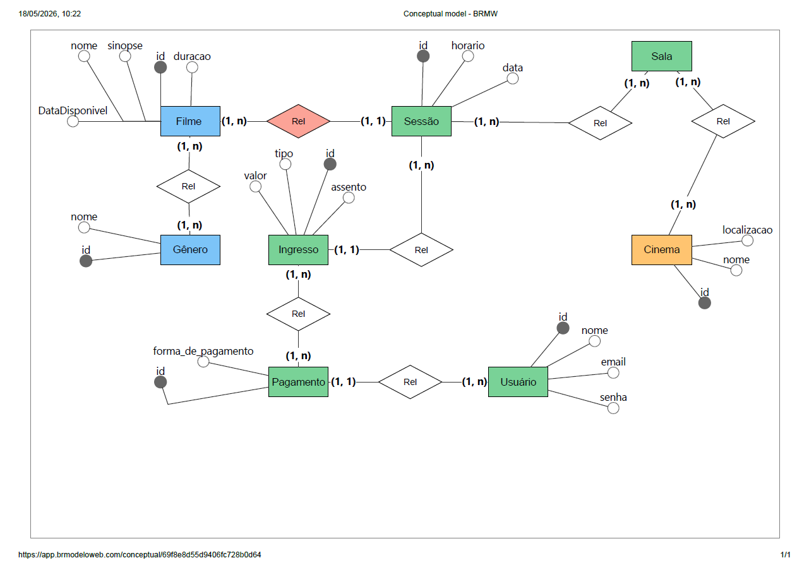

# Sistema de Venda de Ingressos

Projeto de banco de dados desenvolvido para gerenciamento de cinema e venda de ingressos.

---

# Tecnologias

- PostgreSQL
- Neon DB
- DBeaver

---

# Estrutura do Projeto

```txt
📁 postgres
 ┣ schema.sql      → Estrutura do banco
 ┣ inserts.sql     → Dados para teste
 ┗ queries.sql     → Consultas SQL

📁 docs
 ┗ ModeloConceitual.pngs
```

---

# Modelo Relacional



---

# Como Executar

Como Executar o Projeto

## 1. Clone o repositório

```bash
git clone https://github.com/IsabelMelo4/cinema-management-db.git
```

---

## 2. Execute o script principal

Execute o arquivo:

```sql
schema.sql
```

para criar toda a estrutura do banco.

---

## 3. Popular o banco 

Execute:

```sql
inserts.sql
```

para inserir dados de teste.


---

# Desenvolvedora

Isabel Melo